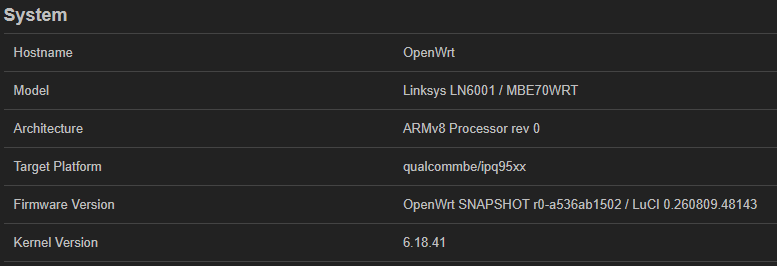

# Linksys Velop WRT Pro 7 (LN6001/MBE70) Lab

**Linksys Velop Pro 7**（ハードウェア識別名：**LN6001 / MBE70WRT**）向けの、
実験的なコミュニティ版 OpenWrt ファームウェアです。

> [!CAUTION]
> これは Linksys または OpenWrt の公式イメージではありません。
> **LN6001 / MBE70WRT 以外にはインストールしないでください。**
> 復旧に使用できる純正ファームウェアのスロットを必ず残してください。

本ビルドは OpenWrt 25.12 開発版 SNAPSHOT をベースとし、
`qualcommbe/ipq95xx` ターゲットを使用しています。LN6001 対応および関連する
Qualcomm ネットワーク対応は現在 OpenWrt 本家より先行しており、本プロジェクトの
フォークで管理しています。将来的には、デバイス対応と汎用的な改善を整理して
OpenWrt 本家への統合を目指します。

### 確認済みビルド情報

| 項目 | 内容 |
| --- | --- |
| 製品 | Linksys Velop Pro 7 |
| LuCI のモデル表示 | Linksys LN6001 / MBE70WRT |
| アーキテクチャ | ARMv8 / AArch64 |
| ターゲット | `qualcommbe/ipq95xx` |
| OpenWrt | `SNAPSHOT r0-a536ab1502` |
| LuCI | `0.260809.48143` |
| Linux カーネル | `6.18.41` |
| ビルド元コミット | `31591d21d8dd650e8522ab268f83e0482b876fab` |



### ファームウェアイメージ

- ファイル：[`firmware/LN6001_OpenWrt_31591d2_LAB.img`](firmware/LN6001_OpenWrt_31591d2_LAB.img)
- サイズ：`32,931,296` bytes
- SHA-256：`d4ac1c94b79952bbe8b49a55dd7e0bb8ed1394bea3dcdb0c4fb4216d3e5800fe`

インストール前に、ダウンロードしたファイルのハッシュを確認してください。

```text
d4ac1c94b79952bbe8b49a55dd7e0bb8ed1394bea3dcdb0c4fb4216d3e5800fe  LN6001_OpenWrt_31591d2_LAB.img
```

このイメージは Linksys 互換のアップグレードラッパーを使用します。書き込み対象は
非アクティブスロットの Wi-Fi ファームウェア、HLOS／カーネル、および rootfs に
限定されています。ブートローダー、パーティションテーブル、ブートローダー環境、
`flash.scr` は含まれていません。

### インストール前の確認

1. ルーターが **LN6001 / MBE70WRT** であることを確認します。外観が似ているだけの
   別の Velop 製品には使用しないでください。
2. Linksys 純正ファームウェアを起動します。動作確認済みの更新元は純正 v1.2 です。
3. もう一方のファームウェアスロットに、起動可能な純正イメージが残っていることを
   確認します。
4. PC を Ethernet でルーターに接続し、更新中は不要な上流側ケーブルを外します。
5. 必要な設定をバックアップします。ただし、純正ファームウェアの設定をこの
   OpenWrt ビルドへ引き継がないでください。
6. 上記の SHA-256 を確認します。
7. 安定した電源を使用し、書き込み中は再起動や電源断を行わないでください。

### 純正 Web インターフェースからのインストール

1. Linksys 純正 Web インターフェースへログインします。
2. 手動ファームウェア更新画面を開きます。
3. `LN6001_OpenWrt_31591d2_LAB.img` を選択します。
4. **設定を保持する／設定を引き継ぐ** に相当するオプションを無効にします。
5. 更新を開始し、電源を入れたまま待ちます。アップロード、書き込み、初回起動には
   数分かかる場合があります。
6. 再起動完了後に Ethernet を接続し直し、PC の DHCP リースを更新します。
7. [http://192.168.1.1/](http://192.168.1.1/) を開いて LuCI へアクセスします。
8. 直ちに root パスワードを設定します。

無線デバイスと無線インターフェースは初期状態で無効です。**ネットワーク → 無線**
で国コード、チャンネル、帯域幅、送信出力を確認してから有効にしてください。

> [!WARNING]
> この `.img` は、動作確認済みの純正 Web 更新手順で使用してください。
> raw `mtd` 書き込み、パーティション操作ツール、強制 `sysupgrade` は使用しないで
> ください。デュアルスロットの保護を迂回し、復旧不能になる可能性があります。

### デュアルファームウェアスロット

純正ファームウェアの更新機能がこのイメージを受け付けると、イメージは
非アクティブ側のファームウェアスロットへ書き込まれ、そのスロットから起動します。
それまで動作していた純正スロットは、通常は復旧用として残ります。

この保護は、ブートローダー、パーティション情報、およびもう一方のスロットが
正常な場合にのみ機能します。デュアルスロットは復旧できる可能性を高めますが、
実験的なファームウェアを完全に安全にするものではありません。

### もう一方のスロットへ切り替える

LN6001 のブートローダーは通常、起動を 3 回中断すると別スロットを選択します。

1. ルーターの電源を入れます。
2. 起動開始から約 5 秒数え、電源を切ります。
3. この「電源オン → 約 5 秒待機 → 電源オフ」を**合計 3 回**行います。
4. 4 回目は電源を入れたままにします。
5. 数分待ってから Ethernet の DHCP リースを更新し、純正 Web
   インターフェースへアクセスできるか確認します。

LED のタイミングは状態によって異なる場合があります。純正ファームウェアへ戻れた
場合は、次の実験を行う前に、Linksys 純正アップデーターで非純正側のスロットへ
最新の純正イメージを書き込んでください。

### SNAPSHOT の制限

- OpenWrt SNAPSHOT のパッケージリポジトリは継続的に更新されます。将来の
  パッケージインデックスには、Linux `6.18.41` と一致するカーネルモジュールが
  残っていない場合があります。
- このイメージにはラボ向けパッケージとフォーク固有の変更が含まれます。
  OpenWrt 本家への提出を想定した最小構成イメージではありません。
- 利用可能な Wi-Fi、チャンネル、DFS、送信出力は、設定した規制ドメインおよび
  デバイスのボードデータに依存します。
- 自動更新サービスおよび公式サポートはありません。

### 免責事項

本ソフトウェアおよびファームウェアは、明示または黙示を問わず、いかなる保証も
伴わない「現状有姿」で提供されます。作者および貢献者は、機器の損傷、設定や通信の
消失、電波法令等への不適合、データ消失、セキュリティ事故、その他の直接的または
間接的な損害について一切の責任を負いません。導入および使用はすべて自己責任です。

---
Experimental community OpenWrt firmware for the **Linksys Velop Pro 7**,
hardware identifiers **LN6001 / MBE70WRT**.

> [!CAUTION]
> This is not an official Linksys or OpenWrt image. Install it only on an
> **LN6001 / MBE70WRT** and keep a working stock-firmware slot available for
> recovery.

This build is based on an OpenWrt 25.12-development SNAPSHOT and uses the
`qualcommbe/ipq95xx` target. Its LN6001 support and related Qualcomm networking
work are maintained in this project's fork and are currently ahead of upstream
OpenWrt. LN6001 is **not yet an officially supported upstream device**. The
long-term plan is to separate the device support and generally useful changes,
submit them upstream, and migrate onto the resulting upstream implementation.

### Verified build information

| Item | Value |
| --- | --- |
| Product | Linksys Velop Pro 7 |
| Model reported by LuCI | Linksys LN6001 / MBE70WRT |
| Architecture | ARMv8 / AArch64 |
| Target | `qualcommbe/ipq95xx` |
| OpenWrt | `SNAPSHOT r0-a536ab1502` |
| LuCI | `0.260809.48143` |
| Linux kernel | `6.18.41` |
| Source commit used for this build | `31591d21d8dd650e8522ab268f83e0482b876fab` |


### Firmware image

- File: [`firmware/LN6001_OpenWrt_31591d2_LAB.img`](firmware/LN6001_OpenWrt_31591d2_LAB.img)
- Size: `32,931,296` bytes
- SHA-256: `d4ac1c94b79952bbe8b49a55dd7e0bb8ed1394bea3dcdb0c4fb4216d3e5800fe`

Verify the downloaded image before installing it:

```text
d4ac1c94b79952bbe8b49a55dd7e0bb8ed1394bea3dcdb0c4fb4216d3e5800fe  LN6001_OpenWrt_31591d2_LAB.img
```

The image uses the Linksys-compatible upgrade wrapper. Its write payload is
limited to the inactive slot's Wi-Fi firmware, HLOS/kernel, and root
filesystem. It does **not** contain a bootloader, partition table, bootloader
environment, or `flash.scr` payload.

### Before installing

1. Confirm that the router is an **LN6001 / MBE70WRT**. Do not install this
   image on another Velop model merely because its enclosure looks similar.
2. Boot the official Linksys stock firmware. Stock firmware version 1.2 was
   used for the tested upgrade path.
3. Confirm that the other firmware slot still contains a working stock image.
4. Connect a computer to the router by Ethernet and disconnect unnecessary
   upstream network cables during the upgrade.
5. Back up any settings you need, but do not restore stock settings into this
   OpenWrt build.
6. Verify the firmware SHA-256 value shown above.
7. Use stable power. Do not reboot or remove power while the image is being
   written.

### Install through the stock web interface

1. Sign in to the official Linksys stock web interface.
2. Open its manual firmware-update page.
3. Select `LN6001_OpenWrt_31591d2_LAB.img`.
4. Disable **Keep settings**, **Retain configuration**, or the equivalent
   option.
5. Start the update and leave the router powered on. Uploading, writing, and
   the first boot can take several minutes.
6. Reconnect by Ethernet after the router finishes rebooting and renew the
   computer's DHCP lease.
7. Open [http://192.168.1.1/](http://192.168.1.1/) to reach LuCI.
8. Set a root password immediately.

The wireless radios and interfaces are disabled by default. Review the country
code, channel, channel width, and transmit-power settings before enabling them
under **Network → Wireless**.

> [!WARNING]
> Use this `.img` with the tested stock web-upgrade path. Do not use raw `mtd`
> writes, partitioning tools, or forced `sysupgrade` options. Those operations
> can bypass the dual-slot protections and may make recovery impossible.

### Dual firmware slots

When this image is accepted by the stock firmware updater, the updater writes
it to the inactive/alternate firmware slot and then boots that slot. The
previously running stock slot should remain available for recovery.

This protection only works while the bootloader, partition metadata, and the
other slot remain intact. A dual-slot design reduces recovery risk; it does not
make experimental firmware risk-free.

### Switch back to the other slot

The LN6001 bootloader can normally select the alternate slot after three
interrupted boot attempts:

1. Power the router on.
2. Count approximately five seconds while it begins booting, then power it
   off.
3. Repeat that power-on, five-second wait, and power-off sequence until it has
   been performed **three times total**.
4. Power the router on a fourth time and leave it powered on.
5. Allow several minutes for the other slot to boot, then renew the Ethernet
   DHCP lease and try the stock web interface.

The exact LED timing can vary. If the router returns to stock firmware, use the
official Linksys updater to install a current stock image into the non-stock
slot before conducting another experiment.

### SNAPSHOT limitations

- OpenWrt SNAPSHOT package repositories move continuously. A later package
  index may no longer contain kernel modules matching Linux `6.18.41`.
- This image includes lab-oriented packages and fork-only changes. It is not
  the clean, minimal image being prepared for possible upstream OpenWrt
  support.
- Wi-Fi availability, channels, DFS behavior, and transmit power remain
  subject to the selected regulatory domain and the device's board data.
- No automatic update service or official support channel is provided.

### Disclaimer

THIS SOFTWARE AND FIRMWARE ARE PROVIDED **AS IS**, WITHOUT WARRANTY OF ANY
KIND, EXPRESS OR IMPLIED. THE AUTHORS AND CONTRIBUTORS ACCEPT NO
RESPONSIBILITY FOR DEVICE DAMAGE, LOSS OF CONFIGURATION OR CONNECTIVITY,
REGULATORY NON-COMPLIANCE, DATA LOSS, SECURITY INCIDENTS, OR ANY OTHER DIRECT
OR INDIRECT LOSS. INSTALLATION AND USE ARE ENTIRELY AT YOUR OWN RISK.
